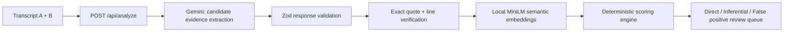

# Architecture notes

## Starting point

The prototype accepted two plain-text deposition transcripts, called an LLM to identify apparent inconsistencies, and rendered the results as visual chips. It lacked an enforceable distinction between direct contradictions, inferential contradictions, and ordinary imprecision. Most importantly, a model could influence the assessment without a clearly auditable, application-owned confidence calculation.

The reusable pieces were the transcript input workflow, candidate-results UI shell, and server-side model route. The detection and scoring path was replaced rather than the full application.

## Final architecture

### Model boundary

Gemini makes one server-side, JSON-schema-constrained extraction call. It can return only:

- Verbatim quote pairs from the two records.
- A neutral topic, entities, and raw time references.
- A concise explanation and a possible reconciliation.

It cannot return a classification, relation label, confidence, probability, severity, priority, recommendation, or legal conclusion. The schema is strict and the application validates it with Zod before any candidate reaches the UI.

This is deliberately a single-call design. A two-call claim-extraction and pair-reasoning pipeline can be useful for much larger transcript collections, but it increases cost, latency, and failure points. For a two-transcript take-home, one candidate-extraction call keeps the design focused while preserving the important boundary: the model proposes evidence; application policy decides what it means.

### Evidence verification

Every returned quotation is searched in its source transcript before display. Verified quotations receive one-based line references. A candidate with either quote missing is excluded from the review queue, preventing a model paraphrase or hallucination from being rendered as evidence.

### Deterministic scoring

`src/lib/analysis/scoring-engine.ts` owns final classification and confidence. It extracts:

- Local MiniLM cosine similarity.
- Normalized time delta using `chrono-node` plus deterministic clock parsing.
- Hedge-language detection.
- Entity-set overlap.
- Polarity opposition.
- An inference-required flag for incompatible timelines without direct opposition.

The named `SCORING_CONFIG` contains every threshold and weight. The decision tree discards low-overlap candidates, suppresses small hedged time differences, marks strong polarity opposition as direct, marks incompatible timelines as inferential, and defaults weak signals to false positive.

Confidence is a clamped weighted sum of these same code-owned features. No LLM confidence field exists in the transport schema or is read by the scorer.

### Local embeddings

Semantic similarity uses `Xenova/all-MiniLM-L6-v2` through `@huggingface/transformers` and ONNX. The model is loaded as a module-level singleton, pre-warmed during Node server startup, and cached locally after its first download. Claim embeddings are also cached in memory by SHA-256 text hash, including duplicate in-flight requests.

This replaces the original feature-hash approximation with materially better semantic comparison while preserving local inference after the model is cached.

### UI and review workflow

The UI presents three distinct categories, review priority, verified quotes and lines, a possible reconciliation for false positives, and an expandable explanation of every confidence factor. Reviewers can filter all results, direct contradictions, inferential contradictions, or false positives.

## Validation

The automated suite has 28 tests covering the decision tree, confidence formula, time normalization, hedge terms, entity overlap, predicate-aware polarity, date-scope guards, wrapped certified-line and unnumbered speaker-block quote verification, embedding-cache reuse, and the direct/inferential/false-positive MiniLM fixtures.

The production UI was also exercised against the included synthetic Marcus Webb transcripts. Gemini returned five verified candidates: two direct contradictions, one inferential contradiction, and two false positives.

## Known trade-offs

- Candidate recall still depends on Gemini surfacing relevant quote pairs. A future scale-up could add atomic-claim extraction and deterministic candidate prefiltering.
- The direct-similarity threshold was intentionally not retuned during the MiniLM source swap; attorney-labeled examples should calibrate it before real legal use.
- The application does not persist evidence, provide authentication, or handle certified PDF/page citations. Those are intentional non-goals for this submission.
