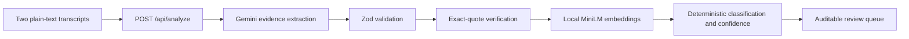

# Legally

Legally compares two deposition transcripts from the same witness and separates candidate inconsistencies into **direct contradictions**, **inferential contradictions**, and **false positives**.

Gemini is used only to extract structured candidate evidence. It does not classify findings or supply confidence, probability, severity, or priority. Those decisions are owned by a deterministic TypeScript scoring engine.

## Architecture



Gemini returns verbatim quote pairs, time references, normalized entities, a possible reconciliation, and a short explanation. `src/lib/analysis/scoring-engine.ts` then extracts deterministic features and applies a named decision tree:

- Entity-set overlap gates unrelated pairs.
- Small hedged time differences become false positives.
- Opposite polarity plus semantic similarity becomes direct.
- Incompatible time claims without direct polarity become inferential.
- Weak or ambiguous signals default to false positive.

All thresholds and confidence weights live in `SCORING_CONFIG`. Confidence is a clamped weighted sum of semantic similarity, entity overlap, polarity, parseable time, and hedge language. No model-provided confidence field exists in this path.

## Local semantic embeddings

`semanticSimilarity` is computed by `Xenova/all-MiniLM-L6-v2` through `@huggingface/transformers`. The ONNX model runs locally in Node.js; scoring does not call an embedding API. On the first installation/run, the model files are downloaded once (about 88–90 MB) and stored under `.cache/transformers`. Subsequent inference uses that local cache.

The feature-extraction pipeline is a module-level lazy singleton, pre-warmed when the Node server starts. Claim embeddings are cached in memory by a SHA-256 hash of their text, including in-flight work, so repeated candidate comparisons do not re-embed identical testimony.

## Features

- Side-by-side editable testimony with `.txt` and `.md` import.
- Server-only Gemini integration through `@google/genai`.
- JSON-schema-constrained extraction plus Zod validation.
- Local MiniLM semantic similarity with no embedding API key.
- Pure deterministic classification policy and confidence formula.
- Direct, inferential, and false-positive filters.
- Exact source quotation verification with one-based line references.
- Input limits, provider timeouts, safe errors, and `no-store` responses.
- Responsive desktop and mobile layouts.
- 27 automated tests, including real MiniLM, wrapped-line, predicate-negation, and date-scope benchmark regressions.

## Run locally

Requirements: Node.js 20.9+ and pnpm. The current dependency set was verified with Node.js 24.14.0, npm 11.6.2, and pnpm 11.9.0.

```bash
pnpm install
cp .env.example .env.local
pnpm dev
```

Set the following in `.env.local`:

```dotenv
GEMINI_API_KEY=your_google_ai_studio_key
GEMINI_MODEL=gemini-3-flash-preview
```

Open [http://localhost:3000](http://localhost:3000). The sample testimony is loaded by default. The server startup log confirms when MiniLM is ready.

Never expose `GEMINI_API_KEY` through a `NEXT_PUBLIC_` variable, paste it into client code, or commit `.env.local`.

## Test and verify

```bash
pnpm test       # unit tests plus direct/inferential/false-positive MiniLM fixtures
pnpm typecheck  # strict TypeScript
pnpm lint       # ESLint
pnpm build      # optimized production build
```

The first `pnpm test` on a clean machine may take longer while MiniLM downloads. Later runs use the local model cache.

The suite covers the deterministic decision tree, weighted confidence formula, time parsing, hedge detection, entity overlap, polarity, quote verification, cache reuse, exact line locations, attempted model-confidence rejection, and all three fixture classifications.

## Security and privacy

- The Gemini key is read only inside the Node.js API route.
- The application does not store transcripts or log their contents.
- Transcripts are treated as untrusted quoted data in the system instruction.
- Input and output cross typed validation boundaries.
- Model quotations must resolve to supplied source text before display.
- MiniLM inference stays local after its one-time model download.

Google's data-use terms vary by Gemini tier. Use synthetic testimony for this demonstration and review the applicable [Gemini pricing and data-use terms](https://ai.google.dev/gemini-api/docs/pricing) before handling confidential material.

## Known limitations

This is a production-minded take-home MVP, not a production legal platform. Real client use still needs attorney-labeled evaluation data, authentication and tenant isolation, rate limiting, audit controls, certified page/line mapping, retention policy, PDF/OCR ingestion, matter-level context, and human acceptance/rejection workflows.

`DIRECT_SIM_THRESHOLD` was intentionally not retuned during the MiniLM source swap. It should be calibrated with labeled deposition pairs before production use.

## Walkthrough

A recording outline and narration script are in [`docs/WALKTHROUGH.md`](docs/WALKTHROUGH.md).
