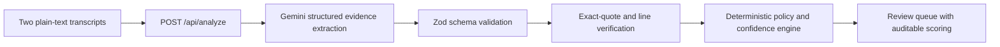

# Legally

Legally compares two deposition transcripts from the same witness, finds changes in testimony with Gemini, and separates them into **direct contradictions**, **inferential contradictions**, and **false positives**.

The model never supplies a confidence score. Gemini extracts candidate evidence and a constrained semantic relation; deterministic TypeScript validates the quotations, assigns the classification, calculates every confidence point, and exposes that calculation in the interface.

## Why this architecture



Gemini's response schema intentionally contains no `confidence`, `probability`, `severity`, `priority`, or final classification field. It returns:

- Verbatim quotation pairs.
- A narrow relation such as `explicit_negation`, `timeline_conflict`, or `scope_mismatch`.
- Subject, event, and scope alignment flags.
- A possible reconciliation and a short evidence-focused explanation.

The application then owns the legal-review taxonomy:

- **Direct** — an explicit negation or mutually exclusive value. An absolute phrase such as “all evening” can promote an extracted timeline conflict to direct.
- **Inferential** — aligned facts that cannot coexist even though neither expressly negates the other.
- **False positive** — compatible statements, material scope differences, insufficient context, or ordinary imprecision.

## Deterministic confidence

`src/lib/analysis/confidence.ts` calculates classification confidence as a clamped sum of named factors. The current policy considers:

- Whether each model quotation resolves to the supplied transcript.
- Subject, event, and factual-scope alignment.
- Whether the extracted relation fits the application policy.
- Locally detected absolute/negative phrases and timeline markers.
- Approximate-time tolerance: differences of 15 minutes or less are suppressed when testimony uses language such as “around” or “approximately.”
- Hedging and plausible-reconciliation penalties.

Candidates with a quotation that cannot be located are excluded from the final payload. The UI exposes every positive and negative factor behind a score. Classification confidence is not case materiality, witness credibility, or a legal conclusion.

## Features

- Side-by-side editable testimony with `.txt` / `.md` import.
- Server-only Gemini integration using `@google/genai`.
- JSON-schema-constrained model output plus Zod semantic validation.
- Direct, inferential, and false-positive filters.
- Exact source quotation verification with one-based line references.
- Deterministic confidence breakdown and review priority.
- Input size limits, request timeouts, safe provider errors, and `no-store` responses.
- Responsive desktop and mobile layouts.
- Synthetic demonstration transcripts and 11 deterministic policy tests.

## Run locally

Requirements: Node.js 20+ and pnpm.

```bash
pnpm install
cp .env.example .env.local
pnpm dev
```

Set these values in `.env.local`:

```dotenv
GEMINI_API_KEY=your_google_ai_studio_key
GEMINI_MODEL=gemini-3.5-flash
```

Open [http://localhost:3000](http://localhost:3000). The sample testimony is loaded by default.

Never expose `GEMINI_API_KEY` through a `NEXT_PUBLIC_` variable, paste it into client code, or commit `.env.local`.

## Quality checks

```bash
pnpm test       # deterministic policy tests
pnpm typecheck  # strict TypeScript
pnpm lint       # Next.js ESLint rules
pnpm build      # optimized production build
```

The test set covers:

- Explicit contradiction.
- Jointly impossible timelines.
- Absolute-claim policy overrides.
- Approximate-time false positives.
- Scope mismatch.
- Hedged, reconcilable statements.
- Inconsistent model metadata.
- Hallucinated quotation exclusion.
- Exact line locations.
- Score repeatability.

## Security and privacy

- The Gemini key is read only inside the Node.js API route.
- The application does not store transcripts or log their contents.
- Transcripts are treated as untrusted quoted data in the system instruction.
- Both input and output cross typed validation boundaries.
- Model quotations must resolve to user-supplied source text before display.

This does **not** mean the model provider has zero retention. Google states that free-tier content may be used to improve its products, while paid-tier terms differ. Use only synthetic data for this demonstration and review the applicable [Gemini pricing/data-use terms](https://ai.google.dev/gemini-api/docs/pricing) before handling confidential material.

## Known limitations

This repository is a production-minded take-home MVP, not a production legal platform. Before real client use it needs:

- Attorney-labeled evaluation data with precision/recall targets for each class.
- Authentication, tenant isolation, rate limiting, and auditable access controls.
- A documented retention/deletion policy and an appropriate provider agreement.
- Certified-page/line mapping rather than line numbers derived from pasted text.
- PDF/DOCX ingestion, OCR quality checks, and speaker-aware transcript parsing.
- Matter-level context and a human workflow for accepting or rejecting findings.
- Configurable jurisdiction/client policies instead of a fixed 15-minute tolerance.

## Walkthrough

A recording outline and narration script are in [`docs/WALKTHROUGH.md`](docs/WALKTHROUGH.md).
