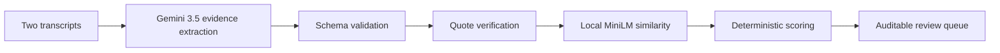

# Legally: high-level app guide

This guide explains Legally in plain English so you can demonstrate the project and answer reviewer questions without having to read the implementation line by line.

## The short version

Legally compares two deposition transcripts from the same witness. Gemini 3.5 Flash finds statement pairs worth reviewing, but application code verifies the quotations, classifies the pair, and calculates confidence.

The most important design rule is:

> The model proposes evidence. Deterministic application policy decides what the evidence means.

This keeps the model away from the hard assignment requirement: confidence must come from our own logic.

## The three outcomes

### Direct contradiction

The two statements make opposing assertions about the same fact.

Example:

- Earlier: "I was at home all evening."
- Later: "I went out to get groceries."

The shared topic is the witness's location. One statement claims continuous presence at home and the other says the witness left.

### Inferential contradiction

The statements do not directly negate one another, but they cannot comfortably coexist after combining time or context.

Example:

- Earlier: "I went to sleep around 10 or 10:30."
- Later: "I went to sleep around midnight."

Neither sentence contains a direct "not," but the two bedtime accounts are materially different. That requires inference rather than simple negation matching.

### False positive

The pair looks inconsistent at first, but normal imprecision, scope, or context can reconcile it.

Example:

- Earlier: "I was alone."
- Later: "My neighbor might have seen me; we waved in the parking lot."

The witness may have been alone inside the home and still had a brief outside interaction. Legally keeps this visible as a dismissed false positive so a reviewer can inspect the reasoning rather than silently losing it.

## What happens after the user clicks Analyze

1. The browser sends both transcripts and their labels to `POST /api/analyze`.
2. Zod checks that the request has the expected fields and acceptable transcript lengths.
3. Gemini 3.5 Flash receives one constrained evidence-extraction prompt.
4. Gemini returns candidate quote pairs, entities, time phrases, an explanation, and an optional reconciliation.
5. A strict response schema rejects unexpected fields. There is no model confidence or classification field.
6. Each quotation is verified against its source transcript. Unsupported candidates are excluded.
7. Local MiniLM embeddings measure semantic similarity between the two claims.
8. The TypeScript scoring engine extracts the remaining deterministic features and applies its decision tree.
9. The UI displays the classified review queue, source evidence, confidence factors, and review priority.



## What Gemini does and does not do

Gemini does:

- Find potentially related statements across the two transcripts.
- Copy short supporting quotations.
- Normalize shared entities such as names, places, objects, and events.
- Extract short time references.
- Explain why a pair deserves review.
- Suggest a possible reconciliation when one exists.

Gemini does not:

- Choose direct, inferential, or false positive.
- Return confidence, severity, priority, or probability.
- Make a legal conclusion.
- Put an unsupported quotation into the final review queue.

This separation matters because language models are useful at broad language understanding but are not a stable policy engine. A named, tested decision tree is easier to audit and tune.

## How deterministic classification works

All thresholds live together in `SCORING_CONFIG`:

| Policy | Current value | Meaning |
|---|---:|---|
| Minimum entity overlap | 0.20 | Discard pairs that probably concern different topics. |
| Small hedged time window | 15 minutes | Treat ordinary approximate-time differences as false positives. |
| Direct similarity threshold | 0.05 | Require some shared semantic topic before a polarity conflict is direct. |
| Inferential time gap | 45 minutes | Allow a materially incompatible timeline to become inferential. |

The simplified decision tree is:

1. Too little entity overlap: discard the candidate.
2. Hedged time difference of 15 minutes or less: false positive.
3. Opposite polarity on a shared assertion: direct contradiction.
4. Materially incompatible time claims without direct opposition: inferential contradiction.
5. Weak or ambiguous evidence: false positive.

The default is deliberately conservative. For a legal review tool, repeated false alarms quickly damage reviewer trust.

## How confidence works

Confidence is not a model opinion and does not mean "probability that this witness lied." It is an evidence-strength score produced from visible features:

```text
35% semantic similarity
+ 25% entity overlap
+ 25% opposite polarity
+ 22% parseable-time evidence
-  8% hedge-language penalty
```

The result is clamped between 0 and 100. Ambiguous times, such as a time with no AM/PM marker, receive only half of the normal time bonus. The UI exposes every contribution under **How this score was calculated**.

## Why MiniLM runs locally

`Xenova/all-MiniLM-L6-v2` provides real sentence embeddings through Transformers.js and ONNX. It runs inside the Node.js server after a one-time model download.

Benefits:

- No embedding API key or per-comparison embedding charge.
- Repeatable inference with no network request inside the scoring engine.
- Better semantic recognition than the original feature-hash approximation.
- A process-wide singleton avoids loading the model for every request.
- A SHA-256 in-memory cache avoids embedding identical claim text repeatedly.

Gemini is still a network dependency for candidate discovery. MiniLM is local only for the semantic-similarity feature.

## Evidence verification

The model is asked for verbatim quotes, but Legally does not trust that instruction by itself. Each returned quote must be found in its source transcript before display.

The verifier supports:

- Exact quotation matches.
- Curly and straight quotation punctuation normalization.
- Whitespace and wrapped-line normalization.
- `Q:` / `A:` records.
- Certified `Line N` records.
- Multi-line `THE WITNESS:` answer blocks.
- Best-effort one-based source-line references.

If either quote cannot be verified, the whole candidate is excluded and counted as an unverified model candidate.

## The included demonstration

The Marcus Webb example currently produces this Gemini 3.5 Flash result:

- 4 verified candidates.
- 1 unsupported candidate excluded.
- 2 direct contradictions.
- 1 inferential contradiction.
- 1 false positive.

The exact confidence score can move when Gemini extracts a slightly different complete quote, entity set, or time phrase. The model still never supplies the score; those extracted inputs are passed into the same deterministic formula.

## What the tests prove

The 31-test suite checks the parts we can make deterministic:

- All three expected classifications.
- The confidence formula and named thresholds.
- Hedge and negation detection.
- Entity overlap and local semantic similarity.
- AM/PM ambiguity, midnight rollover, and multi-estimate time ranges.
- Quote verification across line-numbered and wrapped deposition formats.
- Embedding-cache reuse.
- Rejection of a model response that attempts to add confidence.

Passing all tests means the frozen regression behavior is stable. It does not prove perfect recall on every unseen deposition because candidate discovery still depends on Gemini and real testimony can be ambiguous.

## Important production caveat

Legally is a production-minded take-home MVP, not an autonomous legal decision-maker. A safe description is:

> Legally is an attorney review assistant that surfaces and organizes possible inconsistencies. A lawyer verifies every finding against the certified record.

Real confidential use would additionally require attorney-labeled evaluation data, authentication, tenant isolation, encryption and retention controls, certified PDF page/line mapping, rate limiting, audit logs, monitoring, provider agreements, and human acceptance/rejection workflows.

## Common reviewer questions

### Why not let Gemini classify everything?

Because the assignment requires application-owned confidence, and model-only decisions are harder to audit, reproduce, and tune. The hybrid design uses the model where language understanding helps and deterministic code where policy consistency matters.

### Why keep false positives in the UI?

They show that a candidate was considered and intentionally de-escalated. The reconciliation explains why the two statements may coexist, which is more transparent than silently deleting the pair.

### Can the app guarantee 100% accuracy?

It can guarantee the expected result on its frozen regression suite. It cannot guarantee perfect recall or precision on unseen legal testimony. Some statements are genuinely context-dependent, and the scorer cannot evaluate a pair Gemini never proposes.

### What was the hardest implementation problem?

Maintaining the boundary between probabilistic extraction and deterministic judgment while still handling natural testimony. Time expressions, aliases, negation, line wrapping, and approximate speech all required explicit defensive logic and regression tests.

### What would you build next?

First, create a hidden attorney-labeled evaluation set and measure precision and recall per category. Then add certified PDF ingestion and citations, reviewer feedback storage, authentication, audit logging, rate limiting, and monitoring. Only labeled evidence should drive threshold changes.

## Useful commands

```bash
pnpm dev
pnpm test
pnpm typecheck
pnpm lint
pnpm build
```

The local app runs at [http://localhost:3000](http://localhost:3000).
